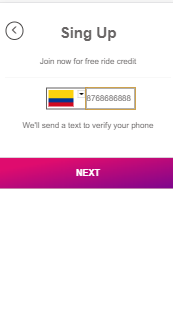
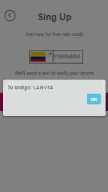
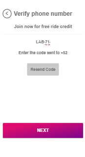
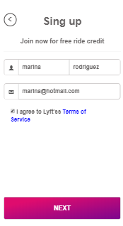

# LYFT APP-WEB

* **Track:** _Common Core_
* **Curso:** _Crea tu propia red social_
* **Unidad:** _Agiliza tu desarrollo_

***
## Objetivos

Desarrollar una web-app que replique el sitio de Lyft, en este reto deberás cumplir los pasos necesarios para que tu usuario pueda registrarse

- Selección del DOM a través de la sintaxis de jQuery.

- Vista splash con duración de 2 a 5 segundos que redirecciona a tu vista de inicio.

- Optimizar la validación de los inputs de un formulario a través de expresiones-regulares

- En la siguiente vista tenemos un formulario donde nuestro usuario puede escoger el país y debe ingresar su número de teléfono. El botón de NEXT debe estar deshabilitado hasta que se ingrese un número de 10 dígitos.

- Para ingresar sus datos necesitamos un formulario que le pida su nombre, apellido y correo electrónico. Deberá también tener un checkbox para que se acepten los términos y condiciones del servicio. 

## Flujo de la aplicación

## Desarrollado con:

- `HTML5` 
- `Jquery` 
- `CSS3` 
- `Bootstrap`
- `msdropdown`

##  Créditos
* [Marina Rodriguez] 